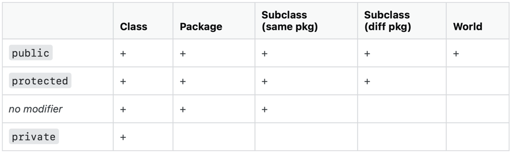

# Bachelor Thesis Practical

## Requirements for easy set up

For a simple setup of this project, [pom.xml](pom.xml) can be used,
the dependencies and plugins contained here are as follows:

* Dependencies:
    * javafx-controls
    * bootstrapfx-core
    * formsfx-core
    * javafx-fxml
    * camunda-bpm-assert
    * jSerialComm
    * junit-jupiter-api
    * graphviz-java
* Plugins:
    * javafx-maven-plugin
* Properties:
    * maven.compiler.source: 20
    * maven.compiler.target: 20
    * project.build.sourceEncoding: UTF-8
* <u>External IDE`s:</u>
  * Camunda Modeler (Version 5.12.0)
  * Arduino IDE (Version 2.1.0)
  * Scene Builder - Gluon

## Build and run the project

To get the project running:
1. Install Camunda Modeler (Version 5.12.0);
2. Make *Maven* executable (run) by use of:\
   ```View > Tool Windows > Maven > i17BA > Run Configurations > i17BA [javafx:run]```

## Code structure and layout

The code structure in the form of classes, methods and attributes can quickly become confusing in such large projects.
Therefore, the following lightweight UML-diagram reveals a structural representation of the back-end. Even though not
all methods (and even classes) are shown, it still illustrates the key connections.


# Operation rules and syntax
* Operations:
  * EGS (Engine-Gear-Shift): 0-6  [-1: down-shift, -99: up-shift]
  * TMD (Time-Duration): 0-int
  * EST (Engine-Status-Type): 0/1
  * RPM (Rotations-per-Minute): 0-4000
  * LED (LED-Light): 0/1
  * HDA (Hall-Delay-Angle): 0-59
  * STI (Sensor-Time-Interval): ->sensorInterval
* Operations Naming Options:
  * EGS: gear, shift, throttle, level, nivo.
  * TMD: time, duration, span, period, term, run, length.
  * EST: engine, motor, machine, unit, main.
  * RPM: rotation, rpm, speed, rev, drill.
  * LED: light, lamp, bulb, sun, led.
  * HDA: degree, hall, angle, delay, commutation, offset, timing.
  * null: default.
* Operations Value Options:
  * (0): stop, end, terminate, finish, off, exit, 0.
  * (1): start, go, run, launch, begin, on, 1.
  * (-99): increase, rise, grow, up, jump.
  * (-1): decrease, reduce, low, les, ease.
  * (Number: 0 - 32767): 0, 1, ..., 32767.
  * (Number: < 0): -404.
  * (NULL): -404.

# Comment structure 
Comments are an important and essential part of clear and comprehensible code. Therefor, we do integrate comments
whenever there is a line of code which is not trivial.\
For further clarification and as a result of active programming we decided to use two types to comments:\
  * `//` for not completed comments and work, like a 'in construction comment'
  * `/* */` and `/** **/`for final comments and work, like a 'final/normal comment'
This structure does not count for code which is not written in java.

## List of References

* Algorithmic-References
    *   
* Frontend-References
    * graphviz-java: [Graphviz Github](https://github.com/nidi3/graphviz-java)
* Hardware-References
    * Arduino IDE-language: [Arduino LANGUAGE](https://www.arduino.cc/reference/en/)
    * Arduino API List: [Arduino List Library  2.1.4](https://nkaaf.github.io/Arduino-List/html/index.html)

## Idea Heritage
* Gear separation from the Porsche 911 GT3 RS:
  * 1st Gear: 0 - 71 km/h (Extrapolated RPM: 0 - 820 RPM)
  * 2nd Gear: 71 - 121 km/h (Extrapolated RPM: 820 - 1398 RPM)
  * 3rd Gear: 121 - 178 km/h (Extrapolated RPM: 1398 - 2060 RPM)
  * 4th Gear: 178 - 232 km/h (Extrapolated RPM: 2060 - 2683 RPM)
  * 5th Gear: 232 - 286 km/h (Extrapolated RPM: 2683 - 3306 RPM)
  * 6th Gear: 286 - 345 km/h (Extrapolated RPM: 3306 - 4000 RPM)

## Design Guide

* Main Design-Guide reference:
  * [M2-Material Design](https://m2.material.io/design/color/dark-theme.html)
* Color Scheme Dark-Theme:
  * Color Scheme: [TUM Colors](https://gist.github.com/lnksz/51e3566af2df5c7aa678cd4dfc8305f7)
  * Dark Scheme: [MATERIAL DESIGN - Dark theme](https://m2.material.io/design/color/dark-theme.html#ui-application)
    * Dark: `#121212` - Background
    * TUM Blue: `#0065bd` - Header
    * tum-blue-dark: `#072140` - 
    * tum-grey-1: `#20252A` - Box
    * Red200: `#B00020` `176,0,32` - Warning, Wrong Task
    * Green200: `#018786` `1, 135, 134`- Correct Task
    * tum-blue-light: `#5E94D4` - Label, Event Start/End
    * tum-blue-light-dark: `#9ABCE4` - Event 

# Cheat Zone
* Visibility:
  
    
* Numbers:
  * byte (8): -128 to 127 
  * short (16): −32768 to 32767
  * int (32):−2147483648 to 2147483647
  * long (64): −9223372036854775808 to 9223372036854775807
  * float (32): -3.4e+38 to 3.4e+38 --7 digits
  * double (64): -1.7e+308 to 1.7e+308 --15 digits
  * boolean (1): true to false
  * char (16): all Unicode
* JavaFX:
  * Layers: Stage >> Scene >> Scene-Graph > Root > Branch > Leaf
  * SceneBuilder: JavaFX is functional modeled via SceneBuilder App.
  * Window Size: 647.0 x 200.0
  * Window Position: 781.0, 25.0

# Hardware Connection
* Connection:
  * Type: `Cable`
  * Technique: `Serial` (JSerialComm)
  * Port: `/dev/cu.usbmodem141101`
  * Baud Rate: `115200`
  * Terminal Input: `screen /dev/cu.usbmodem141101 115200`
  * Main information Link: [JSerial GitHub] (https://github.com/Fazecast/jSerialComm)