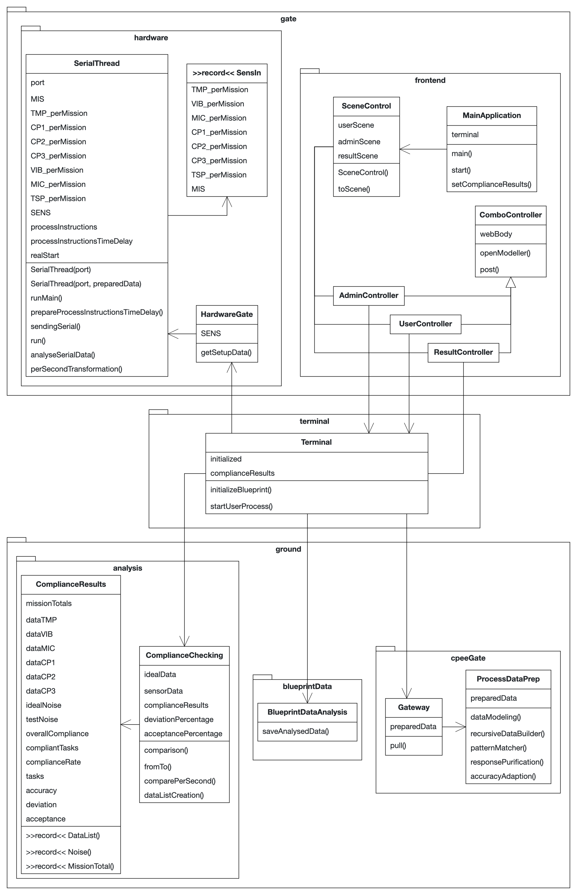

# Bachelor Thesis Practical

## Requirements for easy set up

For a simple setup of this project, [pom.xml](pom.xml) can be used,
the dependencies and plugins contained here are as follows:

* Dependencies:
    * javafx-controls
    * bootstrapfx-core
    * formsfx-core
    * javafx-fxml
    * camunda-bpm-assert
    * jSerialComm
    * junit-jupiter-api
* Plugins:
    * javafx-maven-plugin<
* Properties:
    * maven.compiler.source: 20
    * maven.compiler.target: 20
    * project.build.sourceEncoding: UTF-8
* <u>External IDE`s:</u>
  * Camunda Modeler (Version 5.12.0)
  * Arduino IDE (Version 2.1.0)

## Build and run the project

To get the project and all its windows running:

Make *Maven* executable (run) by use of:\
   ```View > Tool Windows > Maven > i17BA > Run Configurations > i17BA [javafx:run]```

## Code structure and layout

The code structure in the form of classes, methods and attributes can quickly become confusing in such large projects.
Therefore, the following lightweight UML-diagram reveals a structural representation of the back-end. Even though not
all methods (and even classes) are shown, it still illustrates the key connections.



## List of References

* Algorithmic-References
    *
* Frontend-References
    *
* Hardware-Connection-References
    *


# Cheat Zone:
* Visibility:
  * ***private***: Visible just in the <u>Class</u>
  * ***public***: Visible <u>Everywhere</u>
  * ***empty***: Visible in the <u>Package</u>
* Numbers:
  * byte (8): -128 to 127 
  * short (16): −32768 to 32767
  * int (32):−2147483648 to 2147483647
  * long (64): −9223372036854775808 to 9223372036854775807
  * float (32): -3.4e+38 to 3.4e+38 --7 digits
  * double (64): -1.7e+308 to 1.7e+308 --15 digits
  * boolean (1): true to false
  * char (16): all Unicode